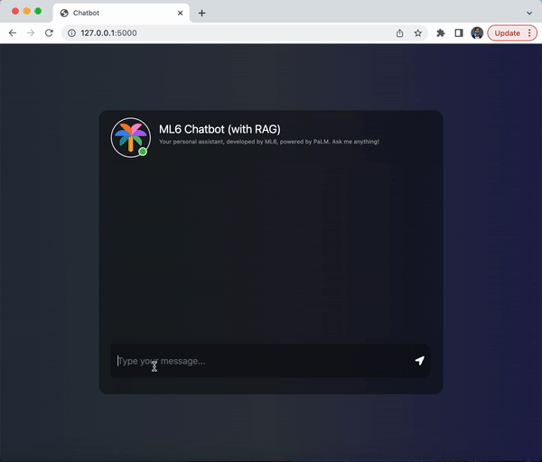

# Introduction
In May 2023, Google released PaLM 2—their next generation LLM. We experimented and built a fundamental Retriever-Augmented Generation (RAG) system (https://bitbucket.org/ml6team/rag-demo-gcp/src/master/).

# Architecture
From the PaLM 2 API, we adopted the `textembedding-gecko` model to create embeddings of passages and the `text-bison` model (aka PaLM 2 for Text) to respond to queries using a relevant retrieved document/passage. Additionally, we used elasticsearch to store embedding vectors and perform kNN vector search.

*Architectural diagram*

# Installation

Steps:
* Install elasticsearch with Docker (see [commands.sh](commands.sh))
* Use the example.env file to create an .env file with environment variables ES_HOST, ES_USER, ES_PASS, and GCP_PROJECT§, based on the elasticsearch installation.
* Enable the Vertex AI API in your Google Console.

# Running the Applications

Steps:
* Populate elasticsearch using `python3 -m src.ingest --input-file=data/documents_10k.tsv` (or any TSV file of choice). Keep in mind that this can take several minutes as it embeds and stores 10k passages (subset from the MS MARCO dataset).
* To locally serve a Flask app with the chatbot and RAG, run `python3 -m app.app`. To run a plain chatbot without RAG functionality, add the `--no-rag` argument.